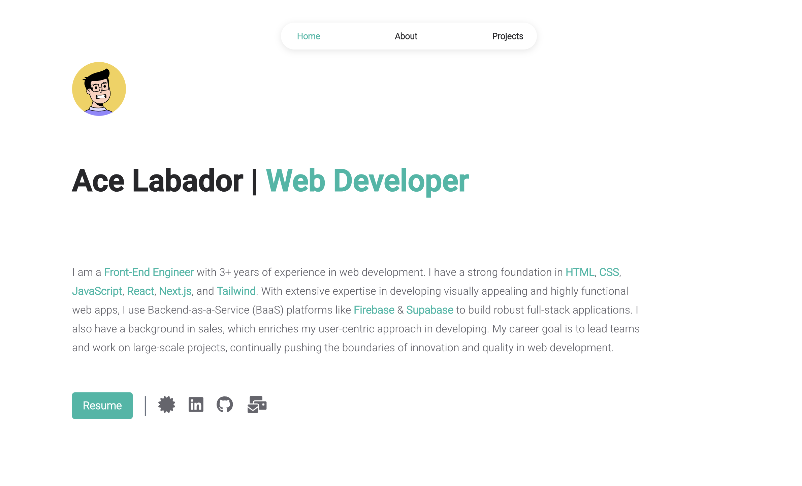

# 🌐 Alas' Personal Portfolio

Welcome to the repository of **Alas' Personal Portfolio** – a modern, fully responsive website showcasing my work, skills, certificates, and experience in web development. This portfolio is designed with performance, aesthetics, and scalability in mind, using the latest web technologies.

 
*Preview of the portfolio landing page*

## 🌐 Deployment

This project is continuously deployed using Vercel. Every push to the main branch triggers a build and deploys the latest version of the site.

🔗 **Live Site**: [alas-dev.vercel.app](https://alas-dev.vercel.app)

## 🚀 Tech Stack

- **React.js**: Core of the interactive UI
- **Vite**: Fast and lightweight build tool for optimized development and production builds.
- **Styled Components**: Custom CSS-in-JS for fine-tuned styling
- **Vercel**: Continuous integration and deployment
- **React Helmet**: SEO enhancements and dynamic page titles
- **Google Analytics 4**: User interaction tracking and content optimization

## 📁 Project Structure

```
/src
    /components   # Reusable UI components
    /pages        # Individual pages (Home, About, Projects, etc.)
        /styles       # Global styles and theme customization
    /data         # User data and configuration files
/public           # Public assets and sitemap
    /assets       # Resumes
    /images       # Images used
generate-sitemap.js  # Script for generating sitemap.xml
```

## 🛠 Features

- **Responsive Design**: Fully responsive across all devices
- **SEO Optimized**: Metadata and structured data for better indexing
- **Animated Components**: Smooth transitions and hover effects
- **Project Showcase**: Curated list of personal and professional projects
- **Resume Button**: Allows users to view and download resume.
- **Certificates Section**: A section within the about page to showcase certificates.

## 🔧 Development

### Clone the Repository

```bash
git clone https://github.com/Alas-3/alas.dev.git
cd alas-dev
```

### Install Dependencies

```bash
npm install
```

### Run the Development Server

```bash
npm start
```

### Build for Production

```bash
npm run build
```

## 🤝 Contributing

Contributions, issues, and feature requests are welcome! Feel free to check the [issues page](https://github.com/Alas-3/alas.dev/issues).

## 📄 License

This project is licensed under the MIT License – see the [LICENSE](https://opensource.org/license/mit) for details.


Enjoy browsing! 🌟 Feel free to reach out if you have any questions or suggestions.